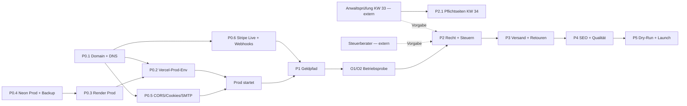

# Launch-Plan — Weg nach Production

**Erstellt:** 2026-08-05
**Scope:** Frontend (`elysion-frontend`) + Backend (`elysion-marketplace-backend`) + Infrastruktur (Vercel / Render / Neon / Stripe)
**Annahmen:** **voller öffentlicher Launch** (nicht Soft-Launch) · **eine Person, ~20 h/Woche** für die Umsetzung
**Zwei Spuren:** Alle Stundenangaben sind **Entwicklungsstunden**. Recht, Steuern, Business/Strategie sowie Firmendaten und Rechtstexte werden **von anderer Stelle verantwortet** und belasten dieses Budget nicht — siehe [§7](#7-externe-spur--nicht-im-entwicklungsbudget).

Verhältnis zu den bestehenden Dokumenten — dieses hier ist das **Wann**:

| Frage                                | Quelle                                                  |
| ------------------------------------ | ------------------------------------------------------- |
| **Was** ist offen?                   | GitHub-Issues beider Repos                              |
| **Warum** ist es offen?              | [`LAUNCH_READINESS.md`](./LAUNCH_READINESS.md)          |
| **Wann** und in welcher Reihenfolge? | **Dieses Dokument**                                     |
| **Was kann schiefgehen?**            | [`PRE_MORTEM.md`](./PRE_MORTEM.md)                      |
| **Welche Regel gilt?**               | [`MANAGEMENT_DECISIONS.md`](../MANAGEMENT_DECISIONS.md) |

> **Status-Legende:** ✅ erledigt · 🟡 teilweise · ❌ nicht begonnen · ⏳ externe Wartezeit

---

## 1. Geschäftszweck-Anker — warum diese Reihenfolge

Elysion ist ein zweiseitiger Marktplatz für nachhaltige Textilien. Der Erlös kommt aus
**15 % Take Rate** auf den Warenwert (§1.1); die beiden Alleinstellungsmerkmale sind
**plattformverifizierte Zertifikate** und das **Werteprofil-Matching**. Daraus folgt die
Priorisierung — jede Phase schützt ein konkretes Geschäftsgut:

| Phase  | Schützt                       | Ohne sie passiert                                                                                          |
| ------ | ----------------------------- | ---------------------------------------------------------------------------------------------------------- |
| **P0** | Betriebsfähigkeit überhaupt   | Prod startet nicht (Fail-fast bei fehlenden Env-Vars), keine Domain für Cookies/CORS/Mails                 |
| **P1** | **Seller-Bindung**            | Erste Auszahlungen laufen manuell an Stripe vorbei → Zahlen driften, Pilot-Seller springen ab (PM 1)       |
| **P2** | **Vertrauens-USP + Existenz** | Green-Claims-/Betreiberpflicht-Abmahnung trifft zuerst den, der mit „nachhaltig zertifiziert" wirbt (PM 2) |
| **P3** | Marge und Servicefähigkeit    | 30–50 % Retourenquote im Textilhandel ohne Retouren-Flow → Chargebacks statt Erstattungen (PM 4)           |
| **P4** | **Auffindbarkeit + Matching** | Öffentlicher Launch ohne SEO-fähige Seiten und ohne Filter = Marketing-Budget verpufft (PM 3)              |
| **P5** | Datenbestand und Reputation   | Zweiter Datenverlust, diesmal mit steuerpflichtigen Finanzdaten (PM 5)                                     |

Nicht-Code-Arbeiten, die denselben Kern betreffen (Zertifikats-SOP, Pilot-Kriterien,
Unit Economics), werden extern verantwortet und stehen in
[§7](#7-externe-spur--nicht-im-entwicklungsbudget).

---

## 2. Ist-Stand, verifiziert am 2026-08-05

Gegen HEAD (`dev`) und die Live-Infrastruktur geprüft — nicht aus der Doku übernommen.
Mehrere Einträge weichen vom dokumentierten Stand ab:

| Bereich                      | Befund                                                                                                                                                                                              | Konsequenz                                                 |
| ---------------------------- | --------------------------------------------------------------------------------------------------------------------------------------------------------------------------------------------------- | ---------------------------------------------------------- |
| Vercel Prod-Env              | Nur `API_URL` + `AUTH_PROXY_SECRET` gesetzt. Es fehlen **alle sechs Portal-Domain-Vars**, `NEXT_PUBLIC_BACKEND_HOST` und `NEXT_PUBLIC_STRIPE_PUBLISHABLE_KEY`                                       | Prod bricht per Fail-fast (FE#168, FE-PR #190) → P0.2      |
| Vercel Prod-Branch           | Steht bereits auf `main`                                                                                                                                                                            | ✅ **FE#14 faktisch erledigt**                             |
| `NEXT_PUBLIC_API_URL` (prod) | Nicht mehr gesetzt — der tote Host `marketplace-backend-1-1w30` ist raus                                                                                                                            | ✅ **FE#145 faktisch erledigt**                            |
| Vercel Domains               | **Keine eigene Domain**, nur `*.vercel.app`; für Prod existieren **keine** `admin.`/`seller.`-Hosts                                                                                                 | Blockiert Cookies, CORS, Mail-Links, Apple Pay → P0.1      |
| Render                       | Nur `elysion-backend-stage` auf **Free-Tier** (60–90 s Kaltstart), **kein Prod-Service**; totes `marketplace-backend-1` existiert weiter                                                            | BE#122, Tier-Entscheidung → P0.3                           |
| Neon                         | Projekt `elysion` auf **Free-Plan**, `history_retention = 6 h`                                                                                                                                      | Keine belastbaren Backups für GoBD-pflichtige Daten → P0.4 |
| Backend-Geldpfad             | `createPayout()` wirft weiterhin `ConflictException`; **kein** `commissionRate` im Java-Code; **keine** Settlement-Line-Items; Admin-Finance read-only; Flyway nur bis `V4__seller_payout_accounts` | Ganze Phase P1                                             |
| Stripe Connect               | Onboarding + Status-Webhook implementiert (BE#110, Commit `ec6452b`)                                                                                                                                | ✅ Voraussetzung für P1 steht                              |
| Frontend Recht               | 27 × `[PLATZHALTER]` (Impressum 11, Datenschutz 9, AGB 5, Widerruf 2) + Firmendaten in `Contact.tsx`                                                                                                | FE#9 → P2.1                                                |
| Frontend Versand             | `Cart.tsx:197` zeigt „Versand: wird berechnet", Gesamtpreis = nur Zwischensumme                                                                                                                     | PAngV-relevant → P3.1/P3.2                                 |
| Frontend Payments            | Zahlarten-Badges (`PaymentMethodBadges.tsx`) und Settlement-Disclaimer sind seit FE-PR #192 **da**                                                                                                  | FE#55/#58 nur noch Restarbeiten                            |
| Produktdaten                 | `taxRate` und `materials` existieren im Typmodell; **keine** GPSR-, LUCID-, DAC7- oder Faserzusammensetzungs-Pflichtfelder                                                                          | §8.4 als echte Code-Arbeit → P2                            |
| Go-Live-Checkliste           | `go-live-checklist.md` beschreibt docker-compose + Caddy auf eigenem Host                                                                                                                           | Passt nicht zu Render/Vercel → P0.11                       |

---

## 3. Kritischer Pfad

**Externe Lead-Zeiten — nicht durch Coden verkürzbar.** Die Spalte **Träger** sagt, wer
das Paket verantwortet: **Dev** kostet Entwicklungsstunden, **Extern** läuft parallel bei
einer anderen Stelle und belastet die 20 h/Woche nicht.

| Vorlauf                                                                          | Träger     | Realistische Dauer  | Status                  |
| -------------------------------------------------------------------------------- | ---------- | ------------------- | ----------------------- |
| Anwaltliche Prüfung — Umfang bestätigt: Shop-Texte _und_ Betreiberpflichten §8.4 | **Extern** | Abschluss **KW 33** | läuft                   |
| Steuerberater (MwSt. §8.1, DAC7, GoBD-Archivierung §8.5)                         | **Extern** | 1–3 Wochen          | in Zuständigkeit extern |
| Firmendaten, Rechtstexte, AV-Vertragsvorlagen, Green-Claims-Wording              | **Extern** | mit der Prüfung     | in Zuständigkeit extern |
| Domain-Kauf + DNS-Propagation                                                    | Dev        | 1–3 Tage            | anstoßen in KW 32       |
| Stripe-Live-Freischaltung (Firmen-/Bankprüfung, Klarna/PayPal je Methode)        | Dev        | 1–10 Werktage       | anstoßen in KW 32       |
| SMTP-Provider + SPF/DKIM/DMARC + Warmup                                          | Dev        | 2–5 Tage            | anstoßen in KW 33       |

**Für den Kalender heißt das:** Die externen Zeilen verlängern den Plan nicht — sie
müssen nur **vor** dem jeweiligen Umsetzungsschritt vorliegen. Verzögert sich dort etwas,
verschiebt sich P2, nicht der Gesamtaufwand.

---

## 4. Phasen

Aufwand in Stunden reiner Umsetzungszeit (inkl. Tests und Doku-Sync, ohne Puffer).

### P0 — Prod-Fundament · 38 h · KW 32–33

| #     | Aufgabe                                                                                                             | Repo     | Issue              | h   | Definition of Done                                                   |
| ----- | ------------------------------------------------------------------------------------------------------------------- | -------- | ------------------ | --- | -------------------------------------------------------------------- |
| P0.1  | Domain kaufen, DNS, drei Vercel-Hosts (apex, `admin.`, `seller.`)                                                   | Infra    | FE#208             | 4   | Alle drei Hosts verified, HTTPS aktiv                                |
| P0.2  | Vercel-Prod-Env vollständig: 6 Domain-Vars, `NEXT_PUBLIC_BACKEND_HOST`, `pk_live`, prod-eigenes `AUTH_PROXY_SECRET` | Infra    | FE#10, FE#209      | 3   | Prod-Build startet ohne Fail-fast; Login auf allen drei Portalen     |
| P0.3  | Render-Prod-Service + **Paid-Tier-Entscheidung** (Free-Kaltstart kostet Erstbesucher)                               | Infra    | BE#122             | 5   | `/actuator/health` grün auf Prod-Domain, Deploy-Branch `main`        |
| P0.4  | Neon-Prod-DB, **Plan-Wechsel weg von Free**, Backup/PITR, Restore-Drill                                             | Infra    | BE#122, BE#192     | 5   | Restore einmal geprobt und schriftlich dokumentiert                  |
| P0.5  | Prod-Secrets, SMTP, CORS, Cookie-Policy                                                                             | BE       | BE#119             | 6   | Verifikations-Mail kommt real an, Cookies `Secure` + korrekte Domain |
| P0.6  | Stripe-Live-Keys + Prod-Webhook + Connect-Webhook                                                                   | BE       | BE#117, BE#118     | 5   | Testkauf live finalisiert Order, beide Webhooks 2xx                  |
| P0.7  | Apple/Google Pay: `.well-known`-Auslieferung + Domain-Registrierung                                                 | FE+Infra | FE#55-Rest, BE#141 | 3   | Wallet-Button erscheint auf Gerät, keine toten Buttons am Desktop    |
| P0.8  | Uptime-Monitoring + Alerting auf Health und Frontends                                                               | Infra    | BE#152             | 3   | Testalarm ausgelöst und empfangen                                    |
| P0.9  | Branch-Protection für `main`/`stage`                                                                                | Ops      | BE#123             | 1   | Direkt-Push blockiert                                                |
| P0.10 | FE#14 + FE#145 verifizieren und schließen; totes `marketplace-backend-1` abräumen                                   | Ops      | FE#14, FE#145      | 1   | Beide Issues geschlossen mit Verifikationsnotiz                      |
| P0.11 | `go-live-checklist.md` von docker-compose/Caddy auf Render/Vercel/Neon umschreiben                                  | BE-Doku  | —                  | 2   | Checkliste beschreibt die reale Topologie                            |

### P1 — Geldpfad end-to-end · 94 h · KW 34–38

Reihenfolge ist zwingend: Line-Items brauchen `commissionRate`, Payouts brauchen Line-Items.

| #     | Aufgabe                                                                                        | Repo | Issue  | h   | Definition of Done                                           |
| ----- | ---------------------------------------------------------------------------------------------- | ---- | ------ | --- | ------------------------------------------------------------ |
| P1.1  | `commissionRate` auf `SellerProfile` (Default 15) + Admin-PATCH-Endpoint                       | BE   | BE#109 | 6   | Admin-Provisions-Editor im FE wirkt real                     |
| P1.2  | Settlement-Line-Items: Ist-Stripe-Fee aus `balance_transaction`, Refund-Fee-, Chargeback-Abzug | BE   | BE#140 | 16  | Kette Brutto → Kommission → Fee → Abzüge → Netto stimmt      |
| P1.3  | `createPayout()` implementieren + `/admin/payouts/due` + `/admin/payouts/run`                  | BE   | BE#111 | 12  | `ConflictException`-Stub ist weg, Freigabe idempotent        |
| P1.4  | Gebrandete Payout-Mail an Seller                                                               | BE   | BE#112 | 4   | Mail bei Freigabe zugestellt                                 |
| P1.5  | Refund-Endpoints: Seller-Self-Service (Full/Partial) + Admin-Eskalation                        | BE   | BE#142 | 12  | Authz greift, Settlement-Reversal korrekt, Audit-Trail da    |
| P1.6  | Settlement-Lifecycle vorläufig → finalisiert + Wochenbericht + Einspruchsfrist                 | BE   | BE#145 | 12  | Bericht finalisiert nach Frist, Korrekturen in Folgeperiode  |
| P1.7  | Seller-/Admin-UI: volle Line-Item-Aufschlüsselung (ohne %-Satz, §1.1)                          | FE   | FE#53  | 8   | Abzüge als eigene Zeile erkennbar                            |
| P1.8  | Seller-Refund-UI (Full/Partial + Grund) und Admin-Auslösen                                     | FE   | FE#56  | 10  | Refund aus dem Drawer real ausgelöst                         |
| P1.9  | Verbindlicher Wochenbericht als eigene Ansicht (Disclaimer steht bereits)                      | FE   | FE#58  | 6   | Verbindlich/unverbindlich klar getrennt                      |
| P1.10 | **Betriebsprobe O1 + O2** auf Stripe-Testkonto                                                 | —    | O1, O2 | 8   | Geld landet auf Seller-Testkonto; Refund kommt beim Buyer an |

### P2 — Recht, Steuern, Betreiberpflichten · 90 h · KW 39–43

> **P2.1 wird vorgezogen (Stand 2026-08-05):** Die anwaltliche Prüfung schließt in
> **KW 33** ab, die Texte liegen damit vor Beginn von P1 vor. `FE#9` (3 h) wird deshalb
> in **KW 34** erledigt statt in KW 39 — damit fällt **Deploy-Blocker B4 im ersten Monat**
> und Staging steht rechtlich sauber da. Die 3 h verschieben P1 kaum; das
> deckt der Puffer. Die restlichen 87 h von P2 bleiben in KW 39–43, weil P2.8/P2.9
> (MwSt., Rechnungen) auf den Settlement-Line-Items aus P1.2/P1.6 aufsetzen.

Die Punkte P2.3–P2.7 sind **§8.4-Betreiberpflichten** — sie treffen Elysion als Plattform,
nicht die Seller. Sie sind seit 2026-08-05 als Issues angelegt (FE#202–FE#205, BE#189).

> **Prüfumfang bestätigt (2026-08-05):** Die anwaltliche Prüfung deckt **auch die
> Betreiberpflichten** ab, nicht nur die Textbausteine. Damit werden P2.3–P2.7 aus einer
> Schätzung eine Spezifikation — die offenen Konstruktionsfragen (blockiert eine fehlende
> LUCID-Nummer das Listing? welche GPSR-Angaben gehören auf die Produktdetailseite? ist
> die Faserzusammensetzung Pflicht- oder Kann-Feld? welche DAC7-Felder ab Tag 1?) werden
> in KW 33 beantwortet statt beim Bauen geraten. Das schließt die Lücke aus
> [`PRE_MORTEM.md`](./PRE_MORTEM.md) Szenario 2.
>
> **Checkpoint KW 34 — vor Beginn von P1:** Prüfergebnis gegen P2.3–P2.7 spiegeln,
> Aufwände nachziehen, die Issues aus [§6](#6-neu-angelegte-issues) mit den echten
> Anforderungen anlegen. Die 42 h für P2.3–P2.7 sind bis dahin eine Ingenieurschätzung;
> verlangt die Prüfung mehr (zusätzliche Pflichtfelder, AV-Vertragsvorlagen,
> Wording-Anpassungen an Produkttexten), geht das zuerst gegen den Puffer.

| #     | Aufgabe                                                                                                             | Repo    | Issue  | h   | Definition of Done                                            |
| ----- | ------------------------------------------------------------------------------------------------------------------- | ------- | ------ | --- | ------------------------------------------------------------- |
| P2.1  | 27 Platzhalter + Firmendaten in Footer und `Contact.tsx` ersetzen                                                   | FE      | FE#9   | 3   | `grep -r PLATZHALTER src/` → 0 Treffer                        |
| P2.2  | Versanddaten-DSGVO: Datenschutz-Abschnitte, Seller-AVV mit Checkbox + Zeitstempel                                   | FE+BE   | BE#99  | 6   | AVV-Zustimmung persistiert, Erklärung deckt Weitergabe ab     |
| P2.3  | **VerpackG § 9:** LUCID-Nummer als Pflichtfeld im Seller-Onboarding + Admin-Prüfschritt                             | FE+BE   | FE#202 | 9   | Ohne LUCID kein aktives Listing                               |
| P2.4  | **GPSR:** verantwortliche Person in der EU + Sicherheitsangaben je Produkt, Anzeige auf PDP                         | FE+BE   | FE#203 | 13  | Pflichtfelder im Produktformular, Anzeige auf der Detailseite |
| P2.5  | **Textilkennzeichnungs-VO:** Faserzusammensetzung vom optionalen Filter zum Pflichtfeld                             | FE+BE   | FE#204 | 7   | Produkt ohne Faserangabe nicht aktivierbar                    |
| P2.6  | **DAC7:** Seller-Steuerdaten erheben (Steuer-ID, Anschrift, Geburtsdatum) + Meldeexport                             | FE+BE   | BE#189 | 10  | Exportdatei mit den meldepflichtigen Feldern                  |
| P2.7  | **Green Claims/EmpCo:** Wording-Richtlinie + Claims-Prüfung im Produkt-Freigabeprozess                              | FE+Doku | FE#205 | 3   | Richtlinie **umgesetzt** (Texte + Prüfschritt im Admin-Flow)  |
| P2.8  | **MwSt. §8.1:** Steuersatz je Produkt durchziehen, USt-Ausweis auf der Provisionsabrechnung                         | FE+BE   | BE#190 | 13  | Checkout und Provisionsabrechnung weisen USt korrekt aus (O4) |
| P2.9  | **Rechnungen §8.5:** Käufer-Rechnung, Provisionsrechnung mit USt, GoBD-Archivierung                                 | FE+BE   | BE#191 | 18  | Beide Rechnungstypen erzeugt und revisionssicher abgelegt     |
| P2.10 | COMPLIANCE-Rest: M1 Datenexport, M2 Barrierefreiheitserklärung, M4 Empfehlungs-Erklärung, M6 Gewährleistungshinweis | FE+BE   | FE#206 | 8   | Vier Tabellenzeilen in `COMPLIANCE.md` auf ✅                 |

### P3 — Versand & Retouren · 98 h · KW 45–49

| #     | Aufgabe                                                                                         | Repo  | Issue  | h   | Definition of Done                                |
| ----- | ----------------------------------------------------------------------------------------------- | ----- | ------ | --- | ------------------------------------------------- |
| P3.1  | Per-Brand-Versandkonfiguration + Berechnung (Stufen, Freiversand, Multi-Brand)                  | BE    | BE#139 | 16  | Preview liefert Versand je Brand-Gruppe + Gesamt  |
| P3.2  | Warenkorb nach Brand gruppieren, Versandzeile statt „wird berechnet", `ShippingInfo` entkoppeln | FE    | FE#52  | 12  | Gesamt = Warenwert + Versand, PAngV-konform       |
| P3.3  | **Buyer-Retouren-Antrag MVP** (Antrag → Seller-Entscheidung → Refund)                           | FE+BE | FE#207 | 22  | Käufer kann Rückgabe ohne E-Mail beantragen       |
| P3.4  | Duplicate-Order-Härtung: Pre-Insert-Guard + täglicher Scan                                      | BE    | BE#146 | 10  | Doppel-Insert unter Last verhindert, Scan flaggt  |
| P3.5  | Admin-Review-UI für geflaggte Duplikate (Storno+Refund / Freigabe)                              | FE    | FE#59  | 8   | Jeder Fall entscheidbar, Status sichtbar          |
| P3.6  | Webhook-Lücken-Erkennung (ausbleibende Stripe-Events)                                           | BE    | BE#151 | 8   | Diskrepanz wird nachgezogen und alarmiert         |
| P3.7  | 48-h-Versand-SLA nach Immediate Capture absichern                                               | BE    | BE#143 | 6   | SLA-Verstoß erkennbar                             |
| P3.8  | Klarna-Reversal als Pflichtschritt im Refund-Flow                                               | BE    | BE#144 | 8   | Storno/Retoure bei Klarna korrekt zurückgeführt   |
| P3.9  | Fehler-Attribution in Checkout-/Payment-Antworten                                               | BE    | BE#147 | 6   | Fehlermeldung nennt Instanz und Konsequenz (§1.9) |
| P3.10 | Late-Success-after-Expiry: Finance-Review-Prozess dokumentieren                                 | BE    | BE#121 | 2   | Runbook-Abschnitt existiert (W6)                  |

### P4 — Shop-Qualität, SEO, Tests · 82 h · KW 50–53

Für einen **öffentlichen** Launch ist das kein Nice-to-have: ohne statische Public-Routen
und ohne Filter läuft jedes Marketing-Budget gegen eine langsame, unfilterbare Liste.

| #     | Aufgabe                                                                               | Repo  | Issue         | h   | Definition of Done                                         |
| ----- | ------------------------------------------------------------------------------------- | ----- | ------------- | --- | ---------------------------------------------------------- |
| P4.1  | `(public)`-Routen auf SSG/ISR (Nonce-CSP von statischen Routen entkoppeln)            | FE    | FE#37         | 10  | Build-Output zeigt ○/ISR statt ƒ, E2E-Smoke grün           |
| P4.2  | Hero-Redesign mit Produktfotografie, zwei Varianten + A/B-Zuweisung                   | FE    | FE#87         | 12  | Variante stabil pro Besucher, Messgröße erfasst            |
| P4.3  | Filter nach Farbe & Größe (Facetten aus dem Backend)                                  | FE+BE | FE#49, BE#136 | 14  | Facetten echt, kein Hardcoding                             |
| P4.4  | Hersteller-/Marken-Multi-Select-Filter                                                | FE+BE | FE#50, BE#137 | 10  | Mehrfachauswahl + Zurücksetzen                             |
| P4.5  | Design-System-Cleanup (Fonts, Dark-Mode-Reste, tote UI-Primitives)                    | FE    | FE#83         | 8   | Konformitäts-Greps aus `DESIGN_SYSTEM.md` leer             |
| P4.6  | Cart-Response-Felder konsistent → Display-Cache nur noch Optimierung                  | BE    | FE#188        | 4   | Warenkorb bleibt bei geleertem Storage vollständig         |
| P4.7  | Admin-Kategorie-Create gegen Prod-Backend reparieren                                  | BE    | FE#178        | 4   | `test.fixme` in `e2e/admin/categories.spec.ts` reaktiviert |
| P4.8  | E2E-Lücken: Checkout ohne Stripe-Extern-Abhängigkeit, Registrierung, Guest-Cart-Merge | FE    | FE#43         | 10  | Kauf-Flow in CI ohne Live-Key grün                         |
| P4.9  | Passwort-Leak im Stage-Smoke maskieren + Credentials rotieren                         | FE    | FE#106        | 4   | Kein Klartext in `error-context.md`                        |
| P4.10 | Monitoring-Persistenz (Ingestion + Admin-Auswertung)                                  | BE    | BE#115        | 6   | Flush landet in der DB, Admin-Sicht zeigt Historie         |

### P5 — Go-Live-Probe & Launch · 20 h · KW 4–5/2027

| #    | Aufgabe                                                          | h   | Definition of Done                            |
| ---- | ---------------------------------------------------------------- | --- | --------------------------------------------- |
| P5.1 | Vollständiger Dry-Run nach überarbeiteter `go-live-checklist.md` | 6   | Alle Haken gesetzt oder bewusst dokumentiert  |
| P5.2 | Restore-Drill wiederholen (mit echtem Datenbestand)              | 3   | Wiederherstellung + Validierung protokolliert |
| P5.3 | Zertifikats-Verifikations-SOP einmal real durchlaufen (O5)       | 3   | Registerabgleich dokumentiert                 |
| P5.4 | Rollback-Punkte scharfstellen, Runbook-Durchsprache              | 2   | Rollback-Pfad in < 15 min ausführbar          |
| P5.5 | `dev → stage → main`-Promotion + Prod-Smoke                      | 4   | Kauf-Flow auf Prod real durchgeklickt         |
| P5.6 | Launch-Beobachtung erste 48 h                                    | 2   | Alerting scharf, niemand fliegt blind         |

---

## 5. Kalender

Basis: 20 h/Woche, Start **KW 32/2026** (ab 2026-08-03).

| Phase         | Aufwand | Wochen | Kalender                 | Meilenstein                                        |
| ------------- | ------- | ------ | ------------------------ | -------------------------------------------------- |
| P0            | 38 h    | 2      | KW 32–33 (03.08.–16.08.) | **M1:** Prod-Umgebung startet und ist erreichbar   |
| P1            | 94 h    | 5      | KW 34–38 (17.08.–20.09.) | **M2:** O1 + O2 real geprobt — Geld fließt         |
| P2            | 90 h    | 5      | KW 39–43 (21.09.–25.10.) | **M3:** Rechtsstand launchfähig, Rechnungen laufen |
| P3            | 98 h    | 5      | KW 44–48 (26.10.–29.11.) | **M4:** Versandpreise korrekt, Retoure bedienbar   |
| P4            | 82 h    | 4      | KW 49–52 (30.11.–27.12.) | **M5:** Shop SEO-fähig, E2E-Suite belastbar        |
| Puffer (15 %) | 63 h    | 3,2    | KW 53–2/2027             | Feiertage KW 52–1 sind hier eingerechnet           |
| P5            | 20 h    | 1      | KW 3/2027                | **M6:** Go-Live                                    |

**Summe: 422 h Entwicklungszeit + 63 h Puffer = 485 h ≈ 24 Wochen.**
**Go-Live-Fenster: KW 3–4/2027 (Mitte bis Ende Januar 2027).**

> **Gegenüber der Erstfassung ~2 Wochen früher.** Grund ist keine schnellere Umsetzung,
> sondern eine sauberere Zurechnung: 20 h Entscheidungs- und Textarbeit lagen im
> Entwicklungsbudget, obwohl sie extern verantwortet werden. Der Kalender bildet jetzt
> ab, was tatsächlich an den 20 h/Woche hängt.

### Annahmen zur Schätzung

Die Stundenwerte sind **Entwicklungsstunden der umsetzenden Person bei Arbeit mit Claude
Code** — also der Arbeitsweise, die dieses Repo ohnehin nutzt (siehe `CLAUDE.md`,
`.github/workflows/claude.yml`). Das ist kein Bonus, der noch abgezogen werden kann; es
ist die Grundannahme.

**Nicht enthalten** ist alles aus [§7](#7-externe-spur--nicht-im-entwicklungsbudget):
Recht, Steuern, Business/Strategie sowie Firmendaten und Rechtstexte werden von anderer
Stelle verantwortet. In der Erstfassung steckten davon ~20 h fälschlich im
Entwicklungsbudget; sie sind herausgerechnet.

Wichtiger als der Gesamtwert ist, **worin** er steckt:

| Art der Arbeit                                                                                        | h    | Durch AI beschleunigbar?                       |
| ----------------------------------------------------------------------------------------------------- | ---- | ---------------------------------------------- |
| Code (Backend-Java, Frontend-React, Tests)                                                            | ~362 | Ja — hier wirkt die Assistenz                  |
| Dashboard-/Infra-Arbeit (Domain, DNS, Vercel-Env, Render, Neon, Stripe-Verifizierung, Uptime-Monitor) | ~32  | Nein — Browser, eigene Zugangsdaten, teils 2FA |
| Manuelle Proben (O1/O2, Restore-Drill, Prod-Dry-Run)                                                  | ~28  | Kaum — der Sinn ist, dass ein Mensch hinsieht  |

**~60 h (14 %) sind gegen jede Beschleunigung immun** — und sie bleiben beim Entwickler,
weil sie technisches Verständnis voraussetzen (DNS-Records, Webhook-Endpunkte,
Restore-Validierung).

**Der Engpass beim Code-Anteil ist das Review, nicht das Schreiben.** In P1 und P2 geht es
um Geld und Steuern: Settlement-Line-Items, Stripe-Fee-Zuordnung, Chargeback-Abzüge,
USt-Ausweis. Schnell erzeugter Code ist dort wertlos, solange er nicht durchdrungen ist —
ein Rechenfehler in der Provision fällt erst auf, wenn ein Seller zu wenig bekommen hat,
und dann ist das Vertrauen weg (PRE_MORTEM Szenario 1). Review-Zeit skaliert mit
Aufmerksamkeit, nicht mit Durchsatz. In P4 (Filter, Hero, Design-Cleanup, E2E) ist die
Hebelwirkung dagegen groß — dort sind 50–60 h statt 82 h realistisch.

**Bandbreite statt Punktschätzung: 21–29 Wochen inkl. Puffer.** KW 3–4/2027 ist die
Mittellage, nicht der Best Case. Die Streuung kommt aus zwei Quellen: der
**Review-Intensität in P1** (Geld- und Steuerlogik) und dem **Umfang, den die
anwaltliche Prüfung für P2.3–P2.7 vorgibt**. Die zweite Quelle klärt sich in KW 33 —
danach lässt sich die Bandbreite spürbar enger ziehen.

**Untergrenze des Kalenders:** Selbst bei doppeltem Tempo im Code landet der Launch nicht
vor **Mitte November 2026** — die 60 h Handarbeit, die externen Vorgaben aus
[§3](#3-kritischer-pfad) und die technische Reihenfolge (P2.8/P2.9 setzen auf P1 auf)
setzen den Boden. Tempo im Code kauft Risikopuffer, keine Kalenderwochen.

### Hebel: Soft-Launch-Schnitt

Wenn früher Erlös wichtiger ist als vollständige Öffentlichkeits-Compliance, lässt sich
dieselbe Reihenfolge kürzen — **ohne** die Reihenfolge zu ändern:

- **Drin:** P0 (38 h) + P1 (94 h) + P2-Kern (P2.1, P2.2, P2.8, P2.9 = 40 h) + Versand P3.1/P3.2 (28 h) + P5 (20 h)
- **Verschoben:** §8.4-Betreiberpflichten (P2.3–P2.7), Retouren-MVP, SEO/Filter/Hero
- **Bedingung:** kleine, kuratierte Seller-Zahl, kein Presse-/SEO-Push, schriftliche Seller-Kommunikation zum Abrechnungsstand
- **Aufwand:** ~220 h + Puffer ≈ 13 Wochen → **Anfang November 2026**

Das ist eine Option, keine Empfehlung — die Entscheidung ist eine Risikoabwägung
(§8.4-Pflichten gelten auch im Soft-Launch, nur ist die Angriffsfläche kleiner).

---

## 6. Neu angelegte Issues

Diese zwölf Arbeitspakete hatten bei Erstellung des Plans in **keinem** Repo ein Issue —
zusammen **115 h** Entwicklungszeit, also gut ein Viertel des Gesamtaufwands. Sie sind am
**2026-08-05** angelegt:

| Issue  | Phase | Thema                                                                   |
| ------ | ----- | ----------------------------------------------------------------------- |
| FE#208 | P0.1  | Eigene Domain + Portal-Subdomains für Produktion                        |
| FE#209 | P0.2  | Vercel-Prod-Env vervollständigen (Domain-Vars, Backend-Host, `pk_live`) |
| BE#192 | P0.4  | Prod-DB aus dem Neon-Free-Plan lösen + Restore-Drill                    |
| FE#202 | P2.3  | VerpackG § 9 — LUCID-Nummer + Prüfpflicht                               |
| FE#203 | P2.4  | GPSR — verantwortliche Person + Sicherheitsangaben je Produkt           |
| FE#204 | P2.5  | Textilkennzeichnungs-VO — Faserzusammensetzung als Pflichtfeld          |
| BE#189 | P2.6  | DAC7 / PStTG — Seller-Steuerdaten ab Tag 1 + Meldeexport                |
| FE#205 | P2.7  | Green Claims / EmpCo — Wording-Richtlinie + Claims-Prüfung              |
| BE#190 | P2.8  | MwSt.-Logik §8.1 — Steuersatz je Produkt + USt auf Provisionsabrechnung |
| BE#191 | P2.9  | Rechnungsstellung §8.5 — Käufer-Rechnung, Provisionsrechnung, GoBD      |
| FE#206 | P2.10 | COMPLIANCE-Rest M1/M2/M4/M6                                             |
| FE#207 | P3.3  | Buyer-Rückgabe-Antrag MVP                                               |

**Zur Repo-Zuordnung:** Die meisten Pakete sind Full-Stack. Angelegt ist je Thema **ein**
Issue im führenden Repo; das Gegenstück ist im Body benannt und wird abgespalten, sobald
der API-Vertrag steht — analog zum bestehenden Paar FE#52 / BE#139. Zwölf halbspekulative
Gegenstück-Issues hätten die Liste verdoppelt, ohne Information hinzuzufügen.

**Zum Reifegrad:** Die sieben Rechts- und Steuer-Issues tragen den Hinweis, dass ihre
Anforderungen bis zum **Checkpoint KW 34** eine Ingenieurschätzung sind. Jedes listet die
offenen Konstruktionsfragen explizit (blockiert eine fehlende LUCID das Listing oder nur
die Auszahlung? Freitext oder strukturierte Faserprozente?) — damit sind sie beim
Prüfungstermin direkt als Fragenkatalog verwendbar.

---

## 7. Externe Spur — nicht im Entwicklungsbudget

Diese Pakete werden **von anderer Stelle verantwortet** und kosten keine der 20 h/Woche.
Sie gaten den Launch trotzdem: Ohne sie fehlen Vorgaben, ohne die einzelne
Umsetzungsschritte nicht abgeschlossen werden können. Fällig ist jedes bis zum genannten
Meilenstein.

**Ebenfalls extern, mit direktem Bezug zu den Phasen:**

| Extern verantwortet                                                  | Wird gebraucht für |
| -------------------------------------------------------------------- | ------------------ |
| Anwaltliche Prüfung (Shop-Texte + Betreiberpflichten §8.4)           | P2.1, P2.3–P2.7    |
| Steuerliche Vorgaben (Steuersätze, DAC7-Meldeweg, GoBD-Archivierung) | P2.6, P2.8, P2.9   |
| Firmendaten (Impressum, Register, USt-ID, Support-Kontakt)           | P2.1               |
| AV-Vertragsvorlage für Seller                                        | P2.2               |
| Green-Claims-Wording-Richtlinie                                      | P2.7               |

**Strategische Entscheidungen ohne Code-Bezug:**

| Thema                                                                                           | Quelle                      | Fällig bis |
| ----------------------------------------------------------------------------------------------- | --------------------------- | ---------- |
| **Zertifikats-Verifikations-SOP** (Registerabgleich, Vier-Augen bei Erstverifizierung)          | §2.4, O5                    | M2         |
| **Pilot-Erfolgskriterien** (Seller-Zahl, GMV, Zeitfenster, Abbruch)                             | §12.1, O6                   | M2         |
| **Unit Economics** — Beispielrechnung Seller-Marge bei 60-€-Bestellung und bei Retoure          | §12.2                       | M2         |
| **Account-Lockout-Entscheidung** bei Brute-Force                                                | §5.1 (als BLOCKER markiert) | M3         |
| **Reconciliation-Rhythmus** (täglicher Stripe-Abgleich, Zuständigkeit)                          | §1.5, PM 1                  | M3         |
| **LEVEL_2/LEVEL_3-Semantik** definieren — das Matching läuft sonst auf undefinierten Kategorien | §2.2                        | M4         |
| **Monitoring-Tool-Grundsatzentscheidung**                                                       | §9.3                        | M5         |
| **Seller-Akquise-Pipeline** (wer spricht welche Labels an)                                      | §12.1, PM 3                 | M5         |

---

## 8. Go-/No-Go-Kriterien

Der Launch wird an **allen drei** Listen gemessen. Stand 2026-08-05:

### Deploy-Blocker (B-Liste, `LAUNCH_READINESS.md` §2)

| #   | Kriterium                                  | Status                | Phase                       |
| --- | ------------------------------------------ | --------------------- | --------------------------- |
| B1  | Stripe-Publishable-Key (`pk_live`) in Prod | ❌                    | P0.2                        |
| B2  | Stripe-Live-Secrets im Backend             | ❌                    | P0.6                        |
| B3  | Stripe-Webhook in Prod erreichbar          | ❌                    | P0.6                        |
| B4  | Rechtliche Pflichtseiten mit Echtdaten     | ❌                    | P2.1 (vorgezogen auf KW 34) |
| B5  | Prod-Secrets, SMTP, CORS, Cookies          | ❌                    | P0.5                        |
| B6  | Plattformgebühr & Payout-Workflow live     | 🟡 FE fertig, BE Stub | P1                          |

### Operations-Readiness (O-Liste, `LAUNCH_READINESS.md` §3)

| #   | Kriterium                                              | Status         | Phase     |
| --- | ------------------------------------------------------ | -------------- | --------- |
| O1  | Payout end-to-end bis aufs Seller-Konto                | ❌             | P1.10     |
| O2  | Refund end-to-end bis zum Buyer                        | ❌             | P1.10     |
| O3  | Backup aktiviert + Restore geprobt                     | ❌             | P0.4      |
| O4  | MwSt. korrekt in Checkout **und** Provisionsabrechnung | 🟡 Checkout ✅ | P2.8      |
| O5  | Zertifikats-SOP existiert und durchlaufen              | ❌             | §7 / P5.3 |
| O6  | Pilot-Erfolgskriterien definiert                       | ❌             | §7        |
| O7  | Alerting aktiv                                         | ❌             | P0.8      |

### Infrastruktur-Gates (neu, aus der Verifikation vom 2026-08-05)

| #   | Kriterium                                                 | Status | Phase |
| --- | --------------------------------------------------------- | ------ | ----- |
| I1  | Eigene Domain inkl. `admin.`/`seller.`-Hosts, HTTPS aktiv | ❌     | P0.1  |
| I2  | Vercel-Prod-Env vollständig (kein Fail-fast beim Start)   | ❌     | P0.2  |
| I3  | Prod-Backend-Service existiert, Tier bewusst gewählt      | ❌     | P0.3  |
| I4  | Prod-DB außerhalb des Free-Plans, PITR/Backup belastbar   | ❌     | P0.4  |

---

_Verwandte Dokumente: [`LAUNCH_READINESS.md`](./LAUNCH_READINESS.md) · [`PRE_MORTEM.md`](./PRE_MORTEM.md) · [`COMPLIANCE.md`](./COMPLIANCE.md) · [`ROADMAP.md`](./ROADMAP.md) · [`MANAGEMENT_DECISIONS.md`](../MANAGEMENT_DECISIONS.md) · Backend `docs/backend/go-live-checklist.md`_
